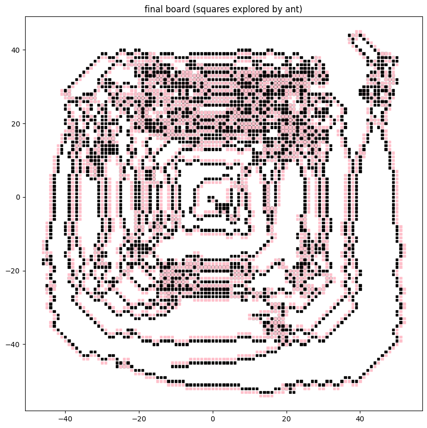

# Langton's ant in an infinite adversarial environment

**Mitchell Krawiec-Thayer**  
_Email:_ ant@mitchellpkt.com

## Abstract

This repository will explore the dynamics of Langton's ant within an infinite adversarial environment. The ant
is [defined as usual](https://web.archive.org/web/20230517163551/https://en.wikipedia.org/wiki/Langton%27s_ant):

+ At a white square, turn 90° clockwise, flip the color of the square, move forward one unit
+ At a black square, turn 90° counter-clockwise, flip the color of the square, move forward one unit

In the variation described here, we introduce an adversarial aspect, by allowing specification of arbitrary initial
board generation procedures, and goals to disrupt highway generation.

## Infinite adversarial environments

### As a game

Here are the key ideas for this variant, explained as an interactive game:
> Upon the ant's first encounter with any given tile, an adversary determines the initial color of the tile, either
> black or white. The adversary's influence is constrained to this initial tile color determination, without any
> additional intervention capabilities.
>
> The adversarial objective is twofold: primary is the prevention of 'highway' construction by the ant, and secondary,
> if the primary objective cannot be fully achieved, is to disrupt the 'highways' as swiftly as possible post-formation.

### As initial conditions

Since the ant is entirely deterministic and the adversary doesn’t have any influence beyond the initial board, the
“game” does not need to be interactive. _To ‘win’ as the adversary, one only needs to produce an initial board (or board
generating procedure) that achieves certain characteristics, even with infinite iterations by the ant._

### Example

In this version of the codebase, the user can provide arbitrary functions for procedural generation of the initial
board. For example, we can define

```python
def concentric_circles(position: Tuple[int, int]) -> Color:
    x, y = position
    distance_from_center = round((x ** 2 + y ** 2) ** 0.5)
    return Color.BLACK if distance_from_center % 2 == 0 else Color.WHITE
```

And then instantiate a board with that function

```python
board: Board = Board(initial_color_picker=concentric_circles)
```

Here is the result after evaluation for 10_000 steps by the ant:

# 

## Rambles

**I am not confident about anything in this section**

I do not have a good intuition for who has the upper hand here. The adversary can be deliberate, but its influence is
strictly limited to controlling initial conditions of the board.

If the adversary provides a board or board generating procedure with finite support (only a finite number of tiles in
the non-default state) then the [Cohen-Kong Theorem](https://lucasschuermann.com/writing/langtons-ant) ensures the ant’s
eventual trajectory will be unbounded and the an will always win. So the real question is how the dynamics unfold when
the adversary provides a board with infinite support.

I don’t think I’ve defined the adversary’s goals very well, mostly because I don’t have a great intuition for the
dynamics yet. Open to suggestions.

Off the cuff, maybe I’d conjecture that there cannot exist any initial configurations such that the ant gets stuck in a
loop of finite length for infinite iterations.

> On any Nth iteration, the ant has only touched <= N tiles. Suppose we do a thought experiment where we create a second
> board that is empty except for the initial states of the touched tiles up to the Nth step. This second board has finite
> support, and so the usual theorems kick in, and consequently the ant will eventually start building a highway that would
> carry it away from the initial loop.

I guess this means the ant can (and will) always progressively expand its territory. It can build highways within its
established turf on any given iteration. However, the adversary can probably create board configurations that prevent
unbounded highways away from established turf (e.g. concentric circles).

I have no idea if this has any real world implications. If it does, please let me know.

